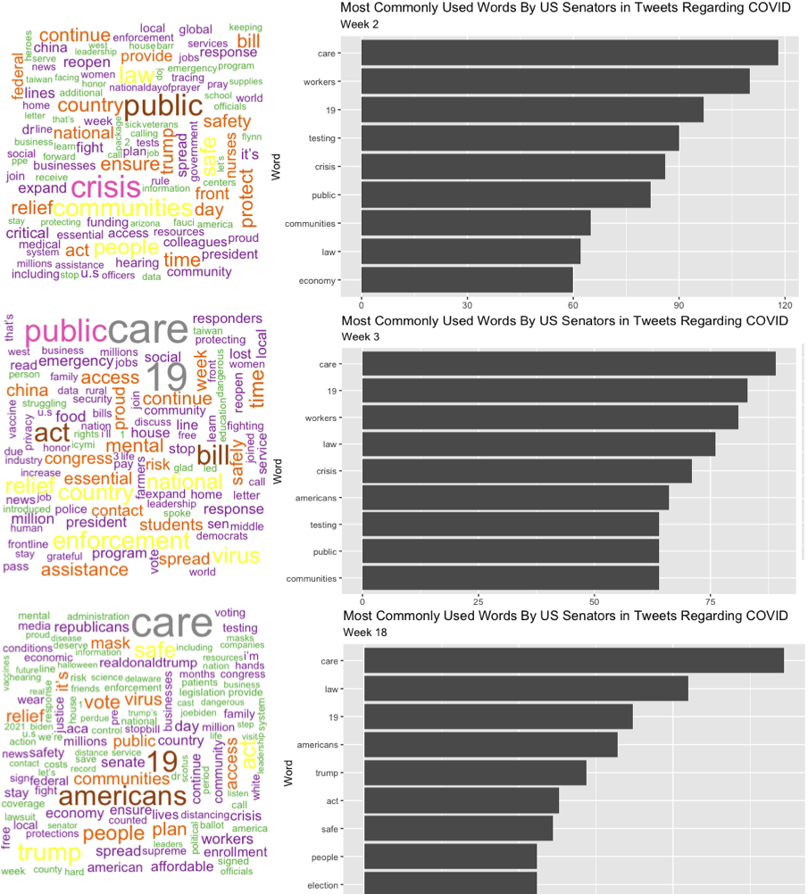
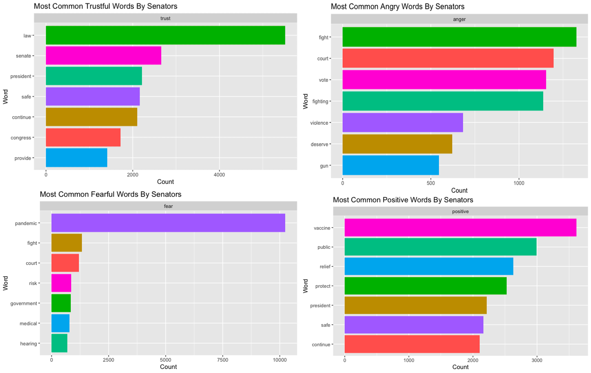

```{r setup, include = FALSE}
library(tidyverse)
library(csv)
library(ggplot2)
require(mosaic)
library(mdsr)
library(RColorBrewer)
library(dplyr)
library(tidyr)
library(usmap)
library(formatR)
library(utils)
library(wordcloud)
library(ggwordcloud)
library(tidytext)
library(knitr)

# Set code chunk defaults 
knitr::opts_chunk$set(echo = FALSE, 
                      mesage = FALSE,
                      warning = FALSE,
                      fig.align = "center")

# Set R environment options
options(knitr.kable.NA = '')
```
# Motivations

As COVID uprooted every aspect of our lives and put us into isolation, the importance of mental health has been recognized more and more. The initial wave of COVID was filled with fear, confusion, loneliness and many other unexpected emotions. Debates over government response became more and more partisan as the pandemic started becoming the new normal. 

Considering the turbulent political and social discourse that occurred during the pandemic, we wanted to examine the correlations between mental health, COVID, and government response and policy. Did the government reflect our mental sufferings? Did our mood improve as the trend of COVID changed? What about in parallel with the public statements of state senators? These factors are fluid in its relationship with each other and in this blog we will dive deeper into this interplay of factors during this global pandemic.

](img/covid-mental.jpg){width=70%}

# How We Got Our Data

## Mental Health Data

We used the raw data from the [Household Pulse Survey - Public Use Files](https://www.census.gov/programs-surveys/household-pulse-survey/datasets.html) from CDC separated by weeks from 1 to 39 in different csv files. This data was a report of the scores of people in two kinds of survey questions by U.S. Census Bureau:

*Adapted PHQ-2 questions (screener for depressive disorder):*

* Over the last 7 days, how often have you been bothered by … having little interest or pleasure in doing things? Would you say not at all, several days, more than half the days, or nearly every day? *Select only one answer.*
* Over the last 7 days, how often have you been bothered by … feeling down, depressed, or hopeless? Would you say not at all, several days, more than half the days, or nearly every day? *Select only one answer.*

*Adapted GAD-2 questions (screener for generalized anxiety disorder):*

* Over the last 7 days, how often have you been bothered by the following problems … Feeling nervous, anxious, or on edge? Would you say not at all, several days, more than half the days, or nearly every day? *Select only one answer.*
* Over the last 7 days, how often have you been bothered by the following problems … Not being able to stop or control worrying? Would you say not at all, several days, more than half the days, or nearly every day? *Select only one answer.*

There were four measured parameters: Anxious, Worry, Down and Interest. As per CDC, a person is considered to be associated from anxiety disorder if the sum of the Anxious and Worry scores is greater than or equal to 4. Similarly, a person is consdered to be associated from depressive disorder if the sum of the Down and Interest scores is greater than or equal to 4.

We wrangled the data to calculate the percentage of people suffering from anxiety and depression by state and week.

Dates were classified as weeks as follows:

<span style="text-decoration:underline">**Week number | start date [year-month-day] - end date [year-month-day]**</span>

1. 2020-04-23 - 2020-05-05
2. 2020-05-07 - 2020-05-12
3. 2020-05-14 - 2020-05-19
4. 2020-05-21 - 2020-05-26
5. 2020-05-28 - 2020-06-02
6. 2020-06-04 - 2020-06-09
7. 2020-06-11 - 2020-06-16
8. 2020-06-18 - 2020-06-23
9. 2020-06-25 - 2020-06-30 
10. 2020-07-02 - 2020-07-07
11. 2020-07-09 - 2020-07-14
12. 2020-07-16 - 2020-07-21
13. 2020-08-19 - 2020-08-31
14. 2020-09-02 - 2020-09-14
15. 2020-09-16 - 2020-09-28
16. 2020-09-30 - 2020-10-12
17. 2020-10-14 - 2020-10-26
18. 2020-10-28 - 2020-11-09
19. 2020-11-11 - 2020-11-23
20. 2020-11-25 - 2020-12-07
21. 2020-12-09 - 2020-12-21 
22. 2021-01-06 - 2021-01-18
23. 2021-01-20 - 2021-02-01 
24. 2021-02-03 - 2021-02-15
25. 2021-02-17 - 2021-03-01
26. 2021-03-03 - 2021-03-15
27. 2021-03-17 - 2021-03-29
28. 2021-04-14 - 2021-04-26
29. 2021-04-28 - 2021-05-10
30. 2021-05-12 - 2021-05-24 
31. 2021-05-26 - 2021-06-07
32. 2021-06-09 - 2021-06-21
33. 2021-06-23 - 2021-07-05 
34. 2021-07-21 - 2021-08-02
35. 2021-08-04 - 2021-08-16
36. 2021-08-18 - 2021-08-30
37. 2021-09-01 - 2021-09-13
38. 2021-09-15 - 2021-09-27
39. 2021-09-29 - 2021-10-11

## Covid Cases and Deaths Data

The dataset which we used is published by the New York Times. The dataset is in itself free to use for any non-commercial purposes. The cases represent the total number of new active positive cases at that point in time and at the given place, which takes into account the people who recovered from COVID-19. The deaths represent the total number of deaths at that point in time and at the given place. 

We wrangled the dataset to arrange it in a weekly fashion consistent with the mental health dataset. We then calculated the percentage of COVID-19 cases and deaths by states and by weeks.

## Twitter Data

{width=60%}

Twitter is one of the biggest social media platforms in the world, with [396 million monthly users](https://datareportal.com/reports/digital-2021-april-global-statshot). In addition to the huge user base, Twitter is a primarily text based social media platform, allowing for easier analysis of qualitative data compared to photo sharing platforms. During the terms of the past two presidents, the platform was also popularized as a political platform for politicians to directly communicate to their constituents. With over 300 thousand tweets from US senators pulled from Twitter’s official API, there is a huge quantity of data to analyze and to even out the short-comings of sentiment and textual analysis. 

*The Data:*

We used Twitter’s user_timeline API in which we pulled the 3000 most recent tweets from a specific account. We then ran through each senator of the past two Congresses and removed the duplicates, in total creating a database of 338,015 tweets. 

After wrangling, each entry had 11 variables:

1. State Abbrevation
2. State Name
3. Name of Senator
4. Tweet Content
5. Source
6. Favorite Count
7. Retweet Count
8. Hashtags
9. Location
10. Date of Tweet
11. Screen Name

*Sentiment Analysis:*

In order to conduct sentiment analysis we filtered through the tweets to include only tweets containing keywords regarding COVID, tokenizing the tweets into single words, and then applying the nrc sentiment database to each word.

# Mental Health

## What is Mental Health?

Mental health plays a vital role in all of our lives. According to [CDC](https://www.cdc.gov/mentalhealth/learn/index.htm), “mental health includes our emotional, psychological, and social well-being. It affects how we think, feel, and act.” It can either increase your quality of life or ruin it. Something this important and serious is oftentimes overlooked by society. According to the [American Psychiatric Association](https://www.psychiatry.org/patients-families/stigma-and-discrimination), the majority of people suffering from mental illness do not receive help for their disorders for various reasons such as concern about being treated differently or fear of losing their jobs and livelihood. This is due to stigma and prejudice against people with mental illness. Because mental health affects everyone, we thought it would be meaningful to explore mental health in the context of the Covid-19 pandemic by analyzing health policies and public sentiments.

## Mental Health Pre-Covid

To look at an aspect of mental health before the Covid-19 pandemic, we looked into the distribution of adults who experienced symptoms of generalized anxiety disorder, which is characterized by excessive worry that is difficult to control accompanied by physical symptoms like fatigue, restlessness, irritability, or sleep disturbance. 

```{r precovid-graph, echo=FALSE, fig.height = 4, fig.width = 6, fig.align = 'center'}
# create dataset from CDC
precovid_anxiety <- data.frame(Symptoms = c("No", "Yes"),
                                Percentage = c(84.4, 15.6))

# create bar chart
precovid_barchart <- ggplot(precovid_anxiety,
                            aes(x = Symptoms, y = Percentage, fill = Symptoms)) + 
  geom_col() + 
  geom_text(aes(label = Percentage), vjust=0) +
  scale_fill_brewer(palette = "Set1") +
  labs(title = "The Percentage of People Who Experienced Symptoms of Anxiety",
       subtitle = "In 2019 (Pre-Covid)",
       x = "Experienced Symptoms",
       y = "Percentage")

precovid_barchart
```

```{r duringcovid-graph, echo=FALSE, fig.height = 4, fig.width = 6, fig.align = 'center'}
# create dataset with calculated mean percentage
covid_anxiety <- data.frame(Symptoms = c("No", "Yes"),
                            Percentage = c(82, 18))

covid_barchart <- ggplot(covid_anxiety,
                         aes(x = Symptoms, y = Percentage, fill = Symptoms)) +
  geom_col() +
  geom_text(aes(label = Percentage), vjust=0) +
  scale_fill_brewer(palette = "Set1") +
  labs(title = "The Percentage of People Who Experienced Symptoms of Anxiety",
       subtitle = "During Covid-19",
       x = "Experienced Symptoms",
       y = "Percentage")
covid_barchart
```

During 2019, about 15.6% of adults experienced symptoms of anxiety. This percentage is lower than the percent of adults who experienced symptoms of anxiety during the time period of Covid-19 (April 23, 2020 - October 11, 2021), which we found to be 18%. The increase in adults experiencing symptoms of anxiety highlights how detrimental Covid-19 was for people’s mental wellbeing. 

## Mental Health During Covid-19

The pandemic of Covid-19 brought upon many drastic changes not only to how we perceive health but to our daily lives. During the pandemic of Covid-19, people were subjected to social isolation and experienced various hardships, so we thought it would be beneficial to analyze the trend of mental health and see how it has been affected in different contexts. 

```{r anxiety-graph, echo=FALSE, message=FALSE}
# import data
mental_health <- read_csv("blog-project/data/mental-health/mental_health.csv") %>%
  filter(State == "National")

# plot anxiety graph with ggplot
anxiety_graph <- ggplot(data = mental_health,
           mapping = aes(x = WEEK,
                         y = anxiety_percentage)) +
      geom_line(aes(x = WEEK,
                    y = anxiety_percentage),
                color = "red") +
      geom_point(aes(x = WEEK,
                     y = anxiety_percentage),
                 color = "red") + 
  geom_smooth(method='lm', formula = y~x) + 
  geom_hline(yintercept = 32.6, linetype = "dashed") +
  theme(plot.title = element_text(size=15), 
            plot.subtitle = element_text(size=10),
            axis.text = element_text(size=10),
            axis.title = element_text(size=10),
            legend.text = element_text(size=10),
            legend.title = element_text(size=10),
            legend.key.size = unit(1, 'cm'),
            plot.caption.position = "plot",
            plot.caption = element_text(hjust = 0)) +
  labs(title = "The Percentage of People Who Experienced Symptoms of Anxiety",
       subtitle = "During Covid (Weeks 1- 39)",
       x = "Week",
       y = "Percentage",
       caption = "Percentage = number of people with anxiety over number of people who took the survey")

df1 <- data.frame(x1 = 5, x2 = 2.3, y1 = 30, y2 = 32.5)
df2 <- data.frame(x1 = 21.5, x2 = 18, y1 = 25.5, y2 = 23.7)

anxiety_graph + 
  annotate("text", x = 5.3, y = 29.2, label = "Week 2", colour = "darkblue") + 
  geom_curve(
    aes(x = x1, y = y1, xend = x2, yend = y2),
    inherit.aes = FALSE,
    data = df1,
    arrow = arrow(length = unit(0.03, "npc"))) + 
  annotate("text", x = 9.4, y = 10.3, label = "Week 3", colour = "darkblue") +
  geom_segment(aes(x = 7.3, y = 10.2, xend = 3.5, yend = 10.2),
               arrow = arrow(length = unit(0.3, "cm"))) + 
  annotate("text", x = 24, y = 25.5, label = "Week 18", colour = "darkblue") + 
  geom_curve(
    aes(x = x1, y = y1, xend = x2, yend = y2),
    inherit.aes = FALSE,
    data = df2,
    arrow = arrow(length = unit(0.03, "npc")))
```

As you can see in this figure above, the general trend of the percentage of people who experienced symptoms of anxiety during the 39 week period of Covid is generally positive. The correlation coefficient - a statistical measure of the strength and direction of the relationship between two variables - is 0.44, which indicates a moderate, positive relationship between weeks and percentage. We noted a few outliers in the trend indicated by the blue text, so we plotted a residuals vs. fitted plot to further explore this relationship.

```{r residuals-plot, echo=FALSE, message=FALSE, fig.height = 4, fig.width = 6, fig.align = 'center'}
gm1 <- lm(anxiety_percentage ~ WEEK, data = mental_health)

mplot(gm1, which = 1)
```

A residuals vs. fitted plot is an easy way to detect unequal error variances, outliers, and non-linearity. It plots the residuals - difference between the observed value of the dependent variable and the predicted value. If the points in a residual plot are randomly dispersed around the horizontal axis, constant variance is likely to be true, thus indicating linear regression to be an appropriate model. As you can see in the residuals vs. fitted plot, weeks 2, 3, and 18 are either significantly higher or below the line at 0 while the rest of the points are randomly scattered above and below the line. This shows that the variance of mental health was generally consistent throughout the 39 weeks with the exception of in the early weeks of Covid and week 18. The variation in the weeks 2-3 are probably due to reasons like people adapting to the different and difficult lifestyle of social isolation and quarantining. After phase 1, the percentage of people suffering from symptoms of anxiety peaked at week 18, which corresponds to October 28, 2020 to November 9, 2020, relative to other weeks towards the end of 2020. Although we cannot deduce anything conclusively, this may be due to the fact that on November 4th the U.S. hit a milestone with 100,000 new Covid-19 cases reported in a single day. This unprecedented spike in cases led to a shortage of N95 masks at health care facilities. On November 5th, there were many published studies that indicated difficulties in nationwide Covid-19 immunity as the path to vaccinating the majority of the country for Covid-19, thus achieving sufficient herd immunity, will be a difficult task. This most likely gave rise to unease and a sense of hopelessness across the nation.

{width=100%}

Looking into the three weeks of outliers we wanted to see if it was a national trend where the states somewhat uniformly worsened (and improved for week 3) mentally or if a region in the country influenced the average with their own anomaly. The three graphs above show the state distribution of anxiety. The biggest difference lies in the Southeast region as it severely worsened from the initial weeks into week 18. Week 3 shows more of a national improvement with no clear outliers compared to the two other graphs that showed peak numbers. While there was also a big variance between the three weeks among the Midwestern states, the population of those states are not big enough to skew the national trend. 
To find out the reasons for these anomalies it is important to examine how these trends line up with the development of COVID in our country.

# Covid-19

Given increasing trends of anxiety and depression, we questioned if this is due to COVID-19 getting worse. In order to visualize this trend we created a line graph plotting the number of new COVID cases per week in the graph below.

```{r covid-cases-graph, echo=FALSE, message=FALSE, fig.height = 4, fig.width = 6, fig.align = 'center'}
timeline_graph <- read_csv("blog-project/shiny/timeline_graph.csv") %>%
  filter(response == "Covid Cases", state == "National")

ggplot(data = timeline_graph,
           mapping = aes(x = week,
                         y = percentage)) +
      geom_line(aes(x = week,
                    y = percentage)) +
      geom_point(aes(x = week,
                     y = percentage)) +
  geom_smooth(method = "lm", se = TRUE, color = "red") +
  
      theme(plot.title = element_text(size=15), 
            plot.subtitle = element_text(size=10),
            axis.text = element_text(size=10),
            axis.title = element_text(size=10),
            legend.text = element_text(size=10),
            legend.title = element_text(size=10),
            legend.key.size = unit(1, 'cm'),
            plot.caption.position = "plot",
            plot.caption = element_text(hjust = 0)) +
      scale_colour_manual(values = c("Covid Cases" = "red")) +
      labs(title = "The Distribution of New COVID-19 Cases",
           subtitle = "During COVID-19 (Weeks 1-39)",
           y = "Percentage of Cases",
           x = "Week", caption = "Percentage = number of new cases in the nation for that week over number of new cases in the nation over all weeks")
```

We can see in the above graph that the cases due to COVID-19 increased in general as we progress along weeks 1 to 39. If we look closely, we can see that the number of new cases per week actually increases. This means that COVID-19 is technically getting worse. We can see this by the positive slope of the graph of the number of cases per week vs. week as shown below. To quantify the change we tried to construct a difference graph. The correlation coefficient for this visualization turned out to be greater than 0.33, and hence we can statistically rely on it for conclusions.

```{r covid-rate-graph, echo=FALSE, message=FALSE}
timeline_graph_up <- read_csv("blog-project/shiny/timeline_graph.csv") %>%
  filter(response == "Covid Cases",state == "National") %>%
  mutate(diff = c(0.0502819,-0.02102229,0.003524543,0.00346709,0.003278399,0.00338682,0.003405226,0.004120342,0.005832997,0.007556452,0.00889334,0.01023633,0.1948606,0.02660811,0.0270676,0.03067617,0.03842486,0.05539291,0.09359305,0.1149099,0.1406222,0.2908593,0.12467,0.08348704,0.05102942,0.04244973,0.03846894,0.08787491,0.0341228,0.02320477,0.01348673,0.008044775,0.008935341,0.05086234,0.07038062,0.09734421,0.1046851,0.09571224,0.07334682))
#for (w in timeline_graph$week) {
#  print(timeline_graph$percentage[w+1] - timeline_graph$percentage[w])
#}

covid_rate <- ggplot(data = timeline_graph_up,
           mapping = aes(x = week,
                         y = diff)) +
      geom_line(aes(x = week,
                    y = diff)) +
      geom_point(aes(x = week,
                     y = diff)) +
      #geom_hline(yintercept = 19.933939, linetype = "dashed") +
  geom_smooth(method = "lm", se = TRUE, color = "blue") +
  geom_vline(xintercept = c(12, 14, 18, 25, 29, 34), linetype = "dashed") +
      theme(plot.title = element_text(size=15), 
            plot.subtitle = element_text(size=10),
            axis.text = element_text(size=10),
            axis.title = element_text(size=10),
            legend.text = element_text(size=10),
            legend.title = element_text(size=10),
            legend.key.size = unit(1, 'cm')) +

      labs(title = "The Rate of Change in Covid Cases",
           subtitle = "During the Covid-19 Period",
           y = "Percentage Difference Between Weeks",
           x = "Week")

#cor(y = timeline_graph_up$diff,x = timeline_graph_up$week)

covid_rate + 
  annotate("text", x = 7, y = 0.23, label = "[2-14]", colour = "red") + 
  geom_segment(aes(x = 8.8, y = 0.23, xend = 13, yend = 0.23),
               arrow = arrow(length = unit(0.3, "cm"))) + 
  annotate("text", x = 21.5, y = 0.01, label = "[18-25]", colour = "red") +
  annotate("text", x = 31.5, y = 0.15, label = "[29-34]", colour = "red")
```

If we look at the change in percentage of covid cases across the weeks, we can see 2 major peaks and 1 valley that stands out from the general trend. The two spikes in the rate of change in COVID-19 occur from weeks 12-14 and 18-25 respectively. The valley occurs from weeks 29-34. Furthermore, we decided to use the time periods weeks 3-12, 14-17, and 35-39 as a control because the rate of change in Covid-19 cases did not change much during that time period. Using the control spatial data, we will indicate certain states that influenced the rate of change of new Covid-19 cases and compare the mental health of that time period.

{width=100%}

{width=100%}
{width=100%}
{width=100%}


For the weeks 12-14, southern states like Texas, Louisiana, and Maryland and northeastern states like New York, Massachusetts, and New Jersey experienced a more rapid growth of new Covid-19 cases compared to the control. As for the distribution of anxiety, no state seemed to stand out other than New Mexico, which had unusually high percentages of adults experiencing symptoms of anxiety. For weeks 18-25, most of the states experienced a higher rate of change in Covid-19 cases; however, it was especially bad in the Midwestern states like North Dakota, South Dakota, and Wisconsin. Interestingly, Vermont had a drastically lower percentage as seen by the dark purple color change to a light yellow color. Oddly enough, the mental health of most of the states was better with the exception of Louisiana and Mississippi. For weeks 29-34, most of the states rate of change in Covid-19 cases became more similar to one another with the exception of Northeastern states like Vermont, New Hampshire, and Maine having dramatically higher rates of change. The West coast, Midwest, and South all generally had lower statistics. As for mental health, the West coast states had lower percentages while New York, Louisiana, and Mississippi were much worse. Although there are many variations among all these trends, it is not uncommon to see states in the same region either perform worse or better together. This is most likely due to the fact that states in certain regions are more politically aligned to one another compared to other states in different regions. Because the government and health policies play a huge role in how the U.S. responds to Covid-19 and other health epidemics like mental health, we will analyze government response.

# Government Responses

```{r sentiment-distribution, echo=FALSE, message=FALSE}
word_cloud <- read_csv2("blog-project/data/textual/senator_wordcloud.csv")
sentiments <- read_csv2("blog-project/data/textual/twitter_sentiments.csv")
tweets <- read_csv2("blog-project/data/textual/senator_tweets_covid.csv")
temp_s2 <- sentiments %>%
  filter(!week == 0,
         sentiments == c("anger","fear","joy","positive","negative","sadness","trust")) %>%
  group_by(week, sentiments) %>%
  summarise(count = sum(count), prc = mean(percentage_of_total_sentiment))
ggplot(temp_s2, aes(x = week, y = prc)) +
  geom_line(aes(color = sentiments)) +
  scale_color_brewer(palette = "Paired") +
  labs(title = "Proportion of Sentiments by Week",
       color = "Sentiments",
       x = "Week",
       y = "Percentage*",
       caption = "*percentage is the number of words that week of each sentiment divided over total words of that sentiment")
```

As stated in the earlier section about the data gathered, we scraped Tweets from US senators from the past two congresses in order to assess the public image of US officials meant to represent us. Each tweet was then split into individual words which then were analyzed using sentiment analysis. The graph above shows the proportion of each sentiment for each week, it helps present how each sentiment changed over time (but doesn’t compare the actual quantity of each sentiment). As the graph shows, the sentiments moved together in relative uniform fashion, most likely due to the total number of tweets each week changing. However the variance of each sentiment grew over the weeks especially at week 16. This shows a greater uncertainty in public communication from the government. Going from heavily positive and optimistic messaging to words of caution and concern in the span of a week serves no function in calming the nation during a national crisis.

## Trends in Common Words

Looking back at the periods that stood out during our COVID and mental health analysis, we wondered if there are any clues to be found on more reasons behind those peaks and troughs. Here were the dates that stood out for mental health: 

* Week 2 - peak in anxiety
* Week 3 - lowest point in anxiety
* Week 18 - slight outlier in anxiety

Looking at the most common words in tweets regarding COVID, there are some obvious words that repeat and skew the data including words like: health, pandemic, coronavirus etc. After filtering out these words here is what we are left with.


{width=100%}
{width=80%}

{width=80%}

It is interesting to note that “care” was the most common word among the entirety of our range of dates. However, when comparing with the overall data the conversation regarding the law wasn’t nearly as prevalent in the initial weeks. While there aren’t any strong correlations between the peaks and troughs of mental health, exploring this opened up interesting questions regarding trends of what US senators deemed important to tweet about. The first two weeks had words like “communities”, “workers”, and “public” lead the way while the overall and week 18 chart shows a much more political selection of words. To explore these trends we decided to look at the trend of these specific words. 

```{r word-trends, echo=FALSE, message=FALSE, fig.height = 4, fig.width = 5.5, fig.align = 'center'}
word_cloud <- read_csv2("blog-project/data/textual/senator_wordcloud.csv")
sentiments <- read_csv2("blog-project/data/textual/twitter_sentiments.csv")
tweets <- read_csv2("blog-project/data/textual/senator_tweets_covid.csv")
temp <- read_csv2("blog-project/data/textual/temp.csv")


word_trend <-  temp %>% 
  filter(week != 0) %>%
  group_by(tokens, week) %>%
  summarise(sum = n()) %>%
  arrange(week) 

word_trend %>%
  filter(tokens %in% c("law","act","bill")) %>%
  group_by(week) %>%
  summarise(sum = sum(sum)) %>%
  ggplot(aes(x = week, y = sum)) +
  geom_point() +
  geom_smooth(method = "lm", alpha = .15) +
  labs(title = "Count of Words Related to Politics in Senator Tweets",
       subtitle = "Words: law, act, bill",
       x = "Week",
       y = "Count",
       caption = "r = 0.33")

word_trend %>%
  filter(tokens %in% c("workers","jobs","economy")) %>%
  group_by(week) %>%
  summarise(sum = sum(sum)) %>%
  ggplot(aes(x = week, y = sum)) +
  geom_point() +
  geom_smooth(method = "lm", alpha = .15) +
  labs(title = "Count of Words Related to Economy in Senator Tweets",
       subtitle = "Words: workers, jobs, economy",
       x = "Week",
       y = "Count",
       caption = "r = -0.22")
```

These two graphs clearly show an opposing trend in what is important to the government with r values of 0.33 and -0.22. As COVID raged on, the focus turned away from the economy and how it affected the people of the US and became a political debate. With senators of both parties debating whose fault the pandemic lies on, the people's mental health worsened. Having personally experienced the fierceness that political debate has acquired in recent years, we wanted to see the sentiment analysis.

## Sentiments

```{r sentiment-total, echo=FALSE, message=FALSE, fig.height = 4, fig.width = 6, fig.align = 'center'}
temp_sent <- sentiments %>%
  group_by(sentiments) %>%
  summarize(sum = sum(count))

temp_sent %>%
  ggplot(aes(x = reorder(sentiments,sum), y = sum)) +
  geom_col(aes(fill = sentiments)) +
  scale_color_brewer(palette = "Set1") +
  coord_flip() +
  theme(legend.position = "none") +
  labs(title = "US Senator Tweet Sentiments",
       x = "Sentiment",
       y = "Count")
```

Looking at this it seems as though the majority of the vocabulary used by senators are positive and encouraging, however like the first graph showed it is the inconsistency in a unified positive message that caused uncertainty in both how we should react to the pandemic and how the government will fight the spread of the virus.

```{r sentiment-trend, echo=FALSE, message=FALSE, fig.height = 4, fig.width = 6.5, fig.align = 'center'}
temp_sent <- sentiments %>%
  group_by(sentiments, week) %>%
  summarize(prc = mean(percentage)) %>%
  filter(week != 0)


temp_sent %>%
  filter(sentiments %in% c("anger","fear","positive","trust")) %>%
ggplot(aes(x = week, y = prc)) +
  geom_line(aes(color = sentiments)) +
  scale_color_brewer(palette = "Set1") +
  geom_smooth(aes(color = sentiments)) +
  scale_color_brewer(palette = "Set1") +
  labs(title = "Change in Sentiments Over Time",
       subtitle = "During COVID-19, Week 1-39",
       x = "Week",
       y = "Percentage",
       caption = "*Percentage is number of each sentiment over total words for that week")
```

{width=100%}
Here you can see the change in each sentiment over the weeks. While there isn’t any significance in the distribution of each sentiment, the slight changes showed decreases in positive and trustworthy sentiments while an increase in angry and fearful sentiments. These changes reflect the trend of COVID, an ever increasing number of new cases with no end in sight. In a time that required the most out of our government to unify and drive our country forward, they instead got entangled in partisan politics that provided little help in our fight against the pandemic and for our mental health.

# Shiny Apps

To explore other features of our spatial data, timeline graph, and wordcloud, click the links below:

* [spatial data](https://dmavani25.shinyapps.io/BlogSpatial/)
* [timeline graph](https://stat231.shinyapps.io/timeline-series/)
* [wordcloud](https://zijizhou.shinyapps.io/Senator-Wordcloud/)


# Limitations

There were many limitations that we came across while investigating our research questions due to either our limited skill set in statistical analysis and creating data visualization and issues with the data itself. Therefore, we strongly urge the audience to take our results with caution. 

When analyzing the mental health data provided by the Household Pulse Survey Public Use Files from CDC, we ran into some obstacles that prevented us from providing the best quality data and visualizations. Although we were given many dates to work with, there are gaps between every time period with some being only two days apart and others being weeks apart. The biggest time gap occurred between week 27 (2021-03-17 - 2021-03-29) and week 28 (2021-04-14 - 2021-04-26) with no data recorded for 16 days in between those time periods. These time gaps prevent us from gaining a more thorough dataset that better encapsulates the mental health journey throughout Covid-19. In other words, the lack of data due to the time gaps could very well be a confounding variable. Due to the nature of the survey, another limitation is nonresponse bias because there could be underrepresentation of certain groups and the number of people suffering from symptoms of depression and anxiety could be less than it actually is. Many people may not be comfortable with sharing their personal experiences with mental health while some may not even be aware that their mental health is suffering due to either cultural reasons, lack of mental health resources, and inaccessibility of mental health care. All of this could have potentially skewed the data. Lastly, we must remind ourselves that the adpated PHQ-2 (screener for depressive disorder) and GAD-2 (screener for generalized anxiety disorder) questions does not diagnose the individual with these disorders but rather indicates the warrant for further diagnostic evaluation. Therefore, it is very likely that not all of these individuals are suffering and diagnosed from generalized anxiety disorder and depressive disorder but rather experiencing isolated symptoms. 

While analyzing the covid cases and deaths data it was difficult to wrangle the data to fit the weekly time frames of the mental health data. There were some unused identifier variables in the initial datasets from the New York Times, which made the wrangling even more tougher and critical. Although the data represented the amount of new cases and deaths each day, there was a factor of population bias in the data which we had. The population bias might be removed with more time and computational power if we had the population count of each state, which is again very dynamic in times of a pandemic. We converted the counts of cases and deaths to the respective percentages to ensure the parallelism in comparison between mental health, covid and sentiment, but there is definitely further scope to analyse the data more statistically in terms of standard deviations and hypothesis tests to make the arguments more statistically pleasing.  

With our analysis of senator tweets came more limitations. By using Twitter’s official API there are a number of call limits including a maximum of 3000 tweets per user. Though that number may seem plenty, with some senators (for example Amy Klobuchar) their tweets are so plentiful we aren’t able to gather data for the full range of date we were looking at. In addition, we started our research in hopes of exploring the sentiment of the people as we thought that would have provided a much wider range of opinions compared to the 100 senators. Lastly, despite the huge dataset we gathered on senator tweets, there is a high variance on the activity of each senator on twitter. For example, some Texas senators only had an account but never tweeted a word. Our usages of percentages instead of raw counts helped alleviate this factor but the data is inevitably skewed by something that has little to do with what we were interested in.


# Further Exploration

We think our study could be improved by further exploring specific states and its health policies and responses in terms of Covid cases and mental health. However, due to our limited statistical analysis knowledge, computational skill sets, and lack of time, we were not able to investigate as deeply and as thoroughly as we would have liked. Also, because our research questions were general, we focused a lot of our analysis and visualizations to encapsulate nationwide data. Therfore, it will be worthwhile to explore these data on a more state by state basis to find other conclusions and interesting results. 

While exploring the spatial data, we found peculiar patterns concerning certain regions. For instance, New York was a state in which its rate of new Covid-19 cases and mental health performance fluctuated a lot throughout the time periods. New York is one of the most densely populated states (according to the 2020 Census) with a population of 19,453,561 people and 412.8 people per square mile. New York has reported a devastating number of 2,699,233 cases as of November 26, 202. Because of this, we think it will be meaningful to further investigate New York for other patterns of Covid-19 and mental health. We could investigate New York by its counties spatially and analyze twitter sentiment of influential public figures and of the general public.  

As previously mentioned, our exploration of public and government response could fare much better with a full collection of Twitter data for tweets regarding COVID. Comparing the response from the general population and US government would grant very valuable insights into the discrepancy between the two when there should be as little as possible.

We want to reemphasize that we generalized anxiety disorder and depressive disorder as "mental health". This could be misleading as these two are not the only mental health disorders that people suffer from. Although anxiety disorders and mood disorders are one of the most common mental health disorders in America, there are so many other disorders and illnesses that should be explored as it deals with other aspects of mental health and targets other groups in the population. For future directions of this project, it would be beneficial to find data regarding other mental health disorders, such as psychotic disorders, dementia, and eating disorders during the Covid-19 period. We hope that through this possible extension of our research, the statistics and data visualization can reveal a clearer picture that could potentially shed light on the mental health of American citizens.
